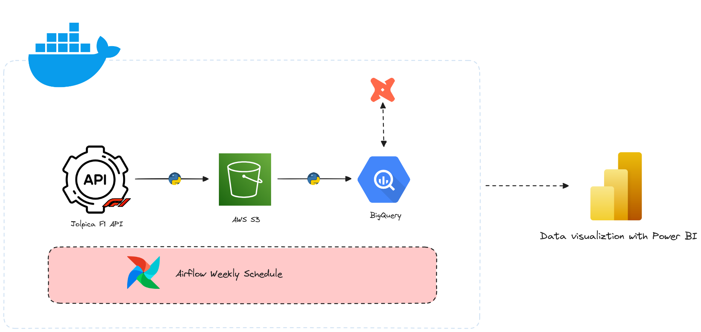

# 🏎️ F1 Data Analysis 📊

This project focuses on collecting, processing, and analyzing Formula 1 🏁 data. The goal is to structure the data effectively in a data warehouse to enable insightful analysis and visualization.

## 📂 Table of Contents

- [Project Overview](#project-overview)
- [Features](#features)
- [Usage](#usage)
- [Project Workflow](#project-workflow)
- [License](#license)

## 📌 Project Overview

Formula 1 generates vast amounts of data, from race results to lap times. This project collects, processes, and loads this data into a structured data warehouse, making it easier to extract insights and build meaningful visualizations.

## 🚀 Features

- 📥 **Comprehensive Data Collection**: Retrieves F1 🏎️ data from the Jolpica API, including race results, sprint results, qualifications, championship standings, pit stop data, and lap times.
  
- 🛠️ **Optimized Data Preparation**: Cleans and structures raw data using Polars to ensure consistency and efficiency.

- 🏦 **Centralized Data Storage**: Loads structured data into Google BigQuery, providing a scalable and reliable data warehouse.

- 📊 **Advanced Data Transformation**: Uses dbt to refine and optimize data models, ensuring high-quality insights. The structured warehouse follows a layered approach (staging → intermediate → marts).

- 📈 **Flexible Data Utilization**: The processed data can be leveraged for dashboards in Power BI, in-depth analysis, or other business intelligence applications.

## ⚙️ Usage

Once the environment is set up, the project allows you to fetch, transform, and analyze Formula 1 data. More details on setup will be provided soon with the addition of a development container.

## 🔄 Project Workflow

1. **📥 Data Collection**: Retrieve race data from the Jolpica API, including results, standings, pit stops, and lap times.

2. **🛠️ Data Preparation**: Clean and format raw data using Polars for consistency and accuracy.

3. **🏦 Data Storage**: Load structured data into Google BigQuery for scalable storage and efficient querying.

4. **📊 Data Transformation**: Use dbt to refine data models, following a structured approach (staging → intermediate → marts) to optimize insights.

5. **📈 Data Utilization**: Leverage the data for dashboards in Power BI, advanced analysis, or other business applications.

## 📜 License

This project is licensed under the MIT License. See the LICENSE file for details.
